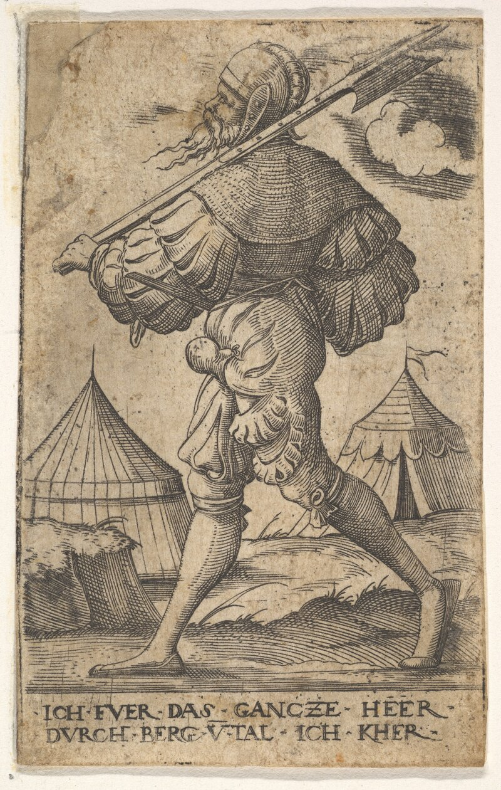

Languette: your hooks need guards.

Virgil Solis, <i>Halberdier walking left</i>, ca. 1530–62. The Metropolitan Museum of Art, <a href="https://www.metmuseum.org/art/collection/search/398969">398969</a>, public domain (CC0). The riveted strips down the shaft are the <i>languettes</i>.

A deterministic check on the actions coding agents take.
